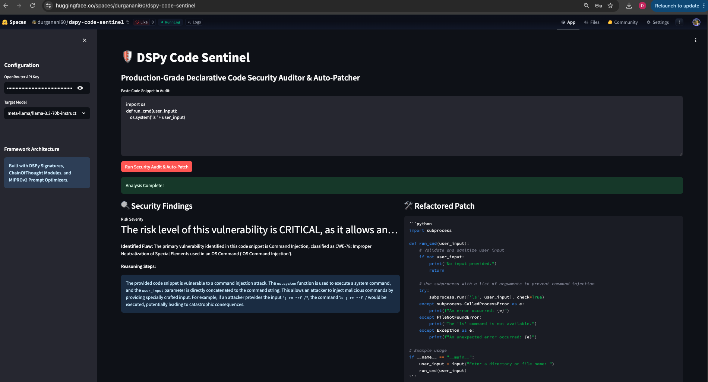

# 🛡️ DSPy Code Sentinel: Self-Optimizing Security Auditor

DSPy Code Sentinel is an enterprise-grade, declarative AI pipeline designed to audit Python code for security vulnerabilities (CWE classifications) and automatically apply secure refactoring patches.

Unlike brittle legacy LLM wrappers that rely on manual string prompting, this system uses Stanford's **DSPy framework** to treat prompts as compiled, data-driven programs.

---

## 🔑 Key Features
* **Declarative DSPy Abstractions:** Uses `Signatures` and `ChainOfThought` modules to decouple application logic from prompt text.
* **MIPROv2 Optimization:** Features programmatic prompt-tuning using MIPROv2 Bayesian optimization over custom security metrics.
* **Multi-LLM Routing:** Dynamic model connectivity via OpenRouter supporting GPT-4o-mini, Claude 3.5 Sonnet, and Llama 3.3 70B.
* **Production UI:** Interactive deployment via Streamlit on Hugging Face Spaces.

---

## 🛠️ Tech Stack
* **LLM Engine:** DSPy
* **Deployment:** Hugging Face Spaces & Streamlit
* **API Aggregator:** OpenRouter API
* **Language/Tooling:** Python 3.11+, Pydantic v2